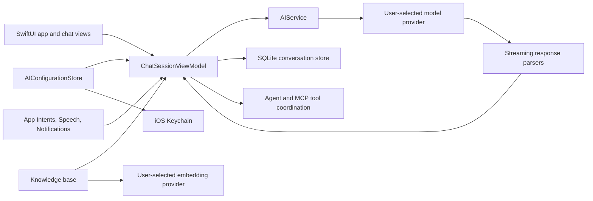

# Architecture

MewyAI is a native iOS client with explicit UI, provider, configuration,
persistence, and tool boundaries. The project uses Swift 6 and defaults target
code to `MainActor`; pure request builders, parsers, and storage helpers are
kept outside view code where practical.

## High-level flow

## Layers

### Application and presentation

`AI Client/App`, `AI Client/Chat`, and `ContentView.swift` contain app lifecycle,
navigation, chat presentation, and user interactions. `ChatSessionViewModel`
owns generation state so provider work is not embedded directly in individual
views.

### Provider transport

`AI Client/AIService` owns URL construction, request bodies, authentication
headers, streaming, response parsing, and tool-loop transport. Provider-specific
formats are represented explicitly:

- OpenAI Chat Completions;
- OpenAI Responses;
- Anthropic Messages;
- Google Vertex AI Express;
- OpenAI-compatible endpoints used by additional provider presets.

Custom base URLs and headers are supported. The configured endpoint is therefore
a security boundary, not merely a cosmetic provider label.

### Configuration and credentials

`AI Client/Configuration` stores provider/model metadata and references to
credentials. API keys, agent secrets, and sensitive custom-header values are
stored as generic-password items in the iOS Keychain. Non-secret settings are
encoded separately so serialized configuration does not need to contain the
credential value.

The multi-key path builds a credential set for a provider and tracks the current
key and cooldown state locally. Retry/failover behavior remains inside the
provider execution layer rather than the UI.

### Persistence

`AI Client/Persistence` stores conversations in `Conversations.sqlite` under the
app's Application Support directory. SQLite owns indexing and atomic updates;
the conversation body remains Codable data to preserve model compatibility.
Searchable metadata is kept alongside the serialized body.

Temporary private conversations are filtered out of the normal persistence
snapshot. That prevents routine local persistence, but it does not prevent the
selected model provider from receiving the conversation during generation.

### Knowledge base

`AI Client/KnowledgeBase` processes supported documents locally, stores the
local index in Application Support, and sends document chunks to the embedding
provider selected by the user. Retrieved snippets may then be included in a
chat request to the active chat provider.

### Tools and platform integration

`AI Client/Agent`, `AI Client/MCP`, and `AI Client/Skills` define tool
capabilities and coordinate executions. `AI Client/AppIntents`, Speech, and
notification helpers adapt those workflows to Apple platform services.

## Security boundaries

1. **Repository boundary:** no production API keys, Apple signing identities,
   user databases, or local Xcode state belong in Git.
2. **Device secret boundary:** credential values belong in Keychain, while
   local conversations and indexes remain app-container files.
3. **Provider boundary:** prompts, history, attachments, tools, and recalled
   context leave the device when required by the selected endpoint.
4. **Tool boundary:** enabled tools may read local context or contact external
   services; the user-selected capability set determines what is exposed.
5. **Apple service boundary:** speech recognition, notifications, App Intents,
   and Keychain follow platform permissions and lifecycle behavior.

## Dependency model

Dependencies are pinned with Swift Package Manager in
`AI Client.xcodeproj/project.xcworkspace/xcshareddata/swiftpm/Package.resolved`.
MarkdownUI, NetworkImage, swift-cmark, ZIPFoundation, and bundled MathJax assets
provide rendering and document-processing support. Their licenses are recorded
in `THIRD_PARTY_NOTICES.md` and bundled license resources.
